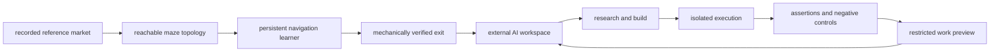

<p align="left"></p>

# project rat race

### the market is the maze.

**$RACE** · [website](https://projectratrace.org) · [x](https://x.com/pr0jectratrace)

A digital navigation experiment with a persistent learning controller, a market-shaped maze, and a treasury-funded AI workspace.

The first task is to find the exit. The larger objective is to make useful work that can help fund continued operation. An escape is a recorded event, not proof of financial independence.

## current launch

Project Rat Race now targets **Robinhood Chain**, ticker **$RACE**, with the official X account [@pr0jectratrace](https://x.com/pr0jectratrace).

The official RACE experiment is activated on Robinhood Chain. Its contract is [`0x14998A0070e4Cb8302925d3126842243Ca3829ED`](https://robinhoodchain.blockscout.com/address/0x14998A0070e4Cb8302925d3126842243Ca3829ED). Prior test runs and token addresses remain separate historical records. Consult the live site's status for its current phase; activation does not mean the maze has been escaped or income earned.

The canonical launch transaction anchors the token's launch evidence. Operator activation is a separate timestamp, used for the run's elapsed display. The AI work stage remains gated on a mechanically verified escape. The reference market feed is not the RACE token price or its trading pair.

Public checkouts still default to an explicitly disabled waiting mode. They cannot activate or spend merely by being opened, and no operator settings or financial records are shipped. Wallets and financial history remain separate from simulation state.

## what this repository contains

This is the official public source release of Project Rat Race. It includes the website, navigation controller, market adapter, browser observation layer, AI agent loop, isolated execution interface, credit protection, narrow payment verification, and automated tests.

Operator credentials, live configuration, wallet material, financial journals, deployment credentials, browsing history and internal build records are deliberately excluded. This source release replaces installation-specific settings with safe operator templates.

## see it locally

Requires Node.js 22 or later.

```sh
npm ci
npm run build
npm start
```

Open `http://127.0.0.1:8789`.

The default command serves a **sealed, read-only preview**. It does not create a wallet, contact a paid model, start a simulation, submit transactions or grant browser access. A preview is not a running experiment.

For frontend development, leave the preview server running and use `npm run dev` in a second terminal.

## the experiment



### navigation and memory

The controller uses a place-cell-inspired, semi-gradient SARSA implementation with fixed spatial features. Market observations, seed and episode determine maze topology. The topology preserves a reachable exit; the controller must still choose the route.

Failed attempts preserve learned weights. The first complete valid route creates an escape record and freezes maze advancement. No countdown forces an exit.

### work beyond the maze

A verified exit permits a separate AI agent to research public information, maintain a workspace, execute Node code in isolation, verify results and produce restricted work previews.

The objective is open ended. There is no prescribed business model, no promised income and no assumption that generated work has customers.

### credit protection

The configured defaults begin refilling at one dollar of AI credit, purchase five dollars of credit, protect a twenty-cent reserve and cap the allowance for an individual inference request at two cents.

Fresh credit is checked before each paid request and checked again under the transport lock. Insufficient or unknown credit produces resumable waiting rather than a new unaffordable request. The refill controller does not need paid inference to operate.

### execution and verification

Generated code runs in a dedicated Linux VM and constrained container. The intended worker mounts no personal folders into the VM. Container networking is disabled, the root filesystem is read only, privileges are dropped, and resources and execution time are bounded.

Printing expected values and exiting successfully is not verification. Executable work must pass a trusted assertion harness, fail a deliberately wrong negative control, and retain a verification record bound to its current source hash before publication.

## science boundary

The browser's anatomical viewer uses a genuine adapted Waxholm rat atlas surface. It is **anatomical reference**, not the neural circuit executing the controller.

The software is not a complete rat brain, uploaded consciousness, live tissue experiment, RatInABox instance or validated biological reconstruction. Scientific references are attributed, not claimed as endorsements. See [research and provenance](docs/RESEARCH.md).

## tests

```sh
npx playwright install chromium
npm test
npm run build
npm run check:privacy
```

Tests use explicit fixtures and temporary state. They must not spend real funds or operate an account. A machine with an existing Chrome installation may set `CHROME_PATH` instead of using Playwright's downloaded browser.

Coverage includes activation gates, market identity and freshness, deterministic topology, route validation, checkpoint integrity, read-only HTTP, path isolation, financial recovery, request budgets, proactive credit checks, frame identity and agent state continuity.

A passing test suite does not prove biological fidelity, complete security or a profitable business. See [verification](docs/VERIFICATION.md).

A ready-to-use GitHub Actions definition is included at [the source-checks workflow template](.github/source-checks.workflow-template.yml). Automatic GitHub execution is not enabled in this release; enabling it requires the repository owner's workflow permission and moving the template into `.github/workflows/`. The source checks and production build were exercised locally before publication.

## operating the full engine

The default preview and the operator engine are deliberately separate.

```sh
cp config/launch.example.json config/launch.json
# configure and verify the operator dependencies before running the engine
npm run start:engine
```

The protected reference worker uses macOS Keychain and a dedicated Lima Linux VM. Operating it requires an independently configured treasury, verified signing identity, current market source, isolated executor, budget policy and explicit launch authorization. Do not enable a funded configuration casually.

The prior test used native ETH on Robinhood Chain for treasury funding. Funding for the new launch remains disabled until explicitly configured. Operator deposits are funding, not verified creator fees or earned income.

Read [architecture](docs/ARCHITECTURE.md), [operator setup](docs/OPERATIONS.md) and [security](SECURITY.md) before enabling anything.

## repository map

| path                          | purpose                                                            |
| ----------------------------- | ------------------------------------------------------------------ |
| `src/`                        | website, sidebar telemetry, mobile navigation and scientific views |
| `server/learner.mjs`          | navigation policy and exit verification                            |
| `server/market-source.mjs`    | exact-contract market observations and provenance                  |
| `server/market-maze.mjs`      | reproducible connected topology                                    |
| `server/agent-loop.mjs`       | persistent AI decision and tool loop                               |
| `server/lima-runner.mjs`      | isolated Node execution                                            |
| `server/work-verifier.mjs`    | assertions and negative controls                                   |
| `server/funding-service.mjs`  | journaled conversion and refill state machine                      |
| `server/wallet-transport.mjs` | trusted wallet and inference transport                             |
| `server/credit-guard.mjs`     | proactive credit admission and reserve                             |
| `server/http.mjs`             | read-only origin interface                                         |
| `functions/`                  | public edge proxy boundaries                                       |
| `public/data/`                | attributed anatomical geometry and provenance                      |

## public interfaces

The origin exposes read-only status, protocol, history, exit, workshop, market and observation routes. The public browser feed is a sequence of recorded frames, not continuous video. A missing worker or stale observation must be shown as unavailable, not replaced with synthetic activity.

Public visitors cannot start the official experiment or authorize spending.

## licensing

Original project code is published for inspection with rights retained. See [LICENSE](LICENSE). Third-party software and adapted research assets retain their respective licenses; see [NOTICE](NOTICE.md) and the anatomical provenance record.
